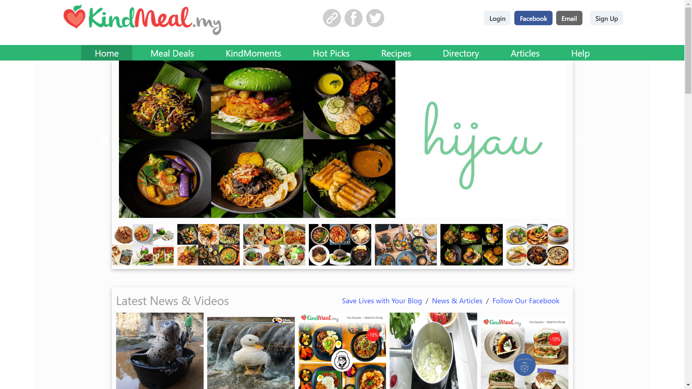
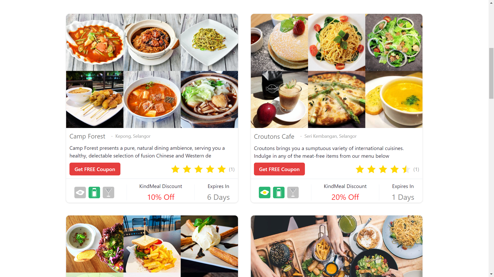
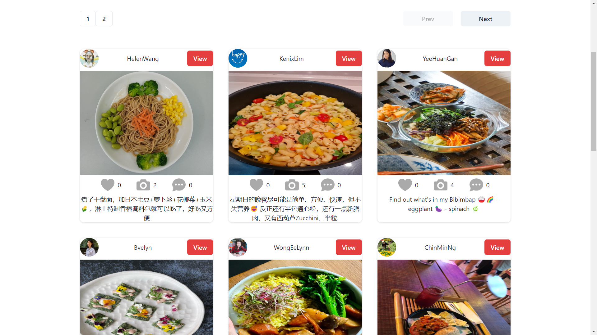
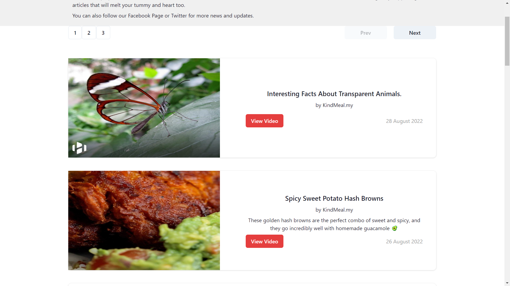

# screenshot

## Library

- React Library
- React Router
- JSON-Server
- Axios
- Chakra UI
- React Slisk

## Functionality

- Single Page App (No loading Page)
- Axios .Create
- Skeleton from Chakra UI
- Modal
- Toast
- Login And Logout
- Pagination
- Filter
- etc

## API

- Reqres API:- https://reqres.in/api/login
- server API:- https://domineering-kick.herokuapp.com/
